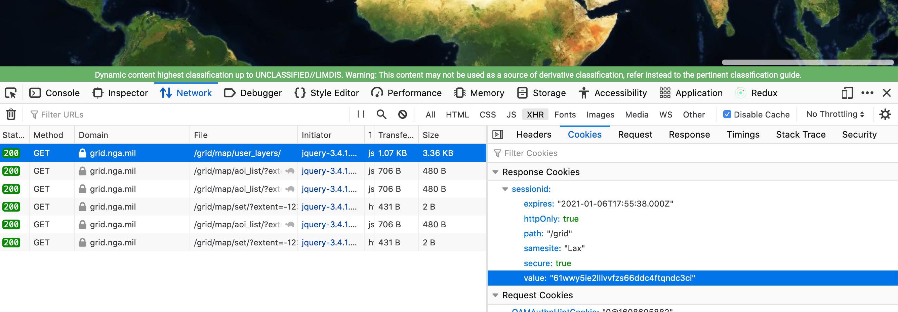

# Grid proxy

This is a toy proxy to some gridmap routes. To use it, you must first get a
`sessionid` token from Grid. You can do this by looking at the `sessionid`
cookie in the network tab on an authenticated request made by the map display
while logged into Grid (see below).

It should be emphasized that nothing here is anywhere close to suitable in
production for anything of any sort - this is a quick-and-dirty way to get
data from Grid without doing anything the proper way.

### Running

```
yarn install
yarn start YOUR_SESSIONID_HERE
```


